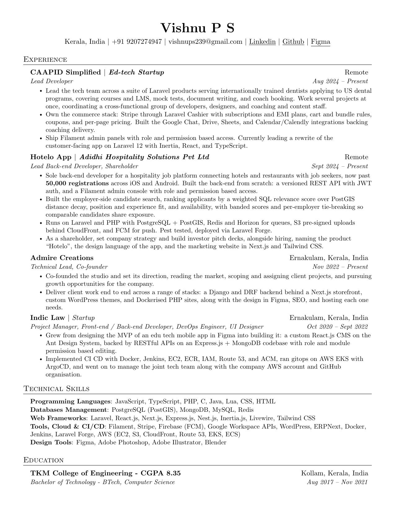
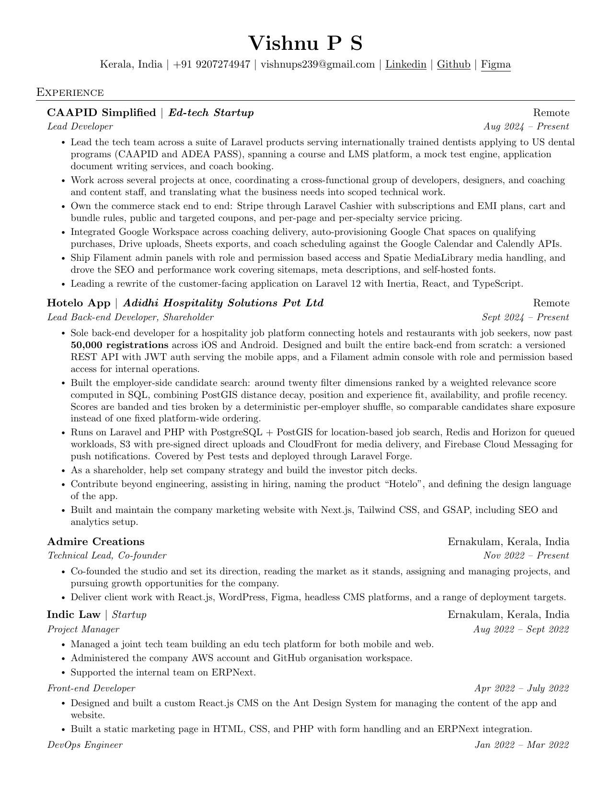
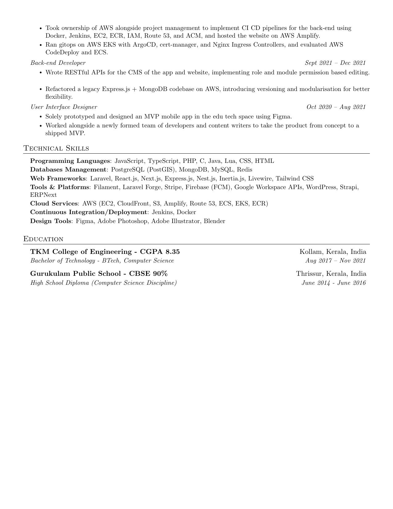
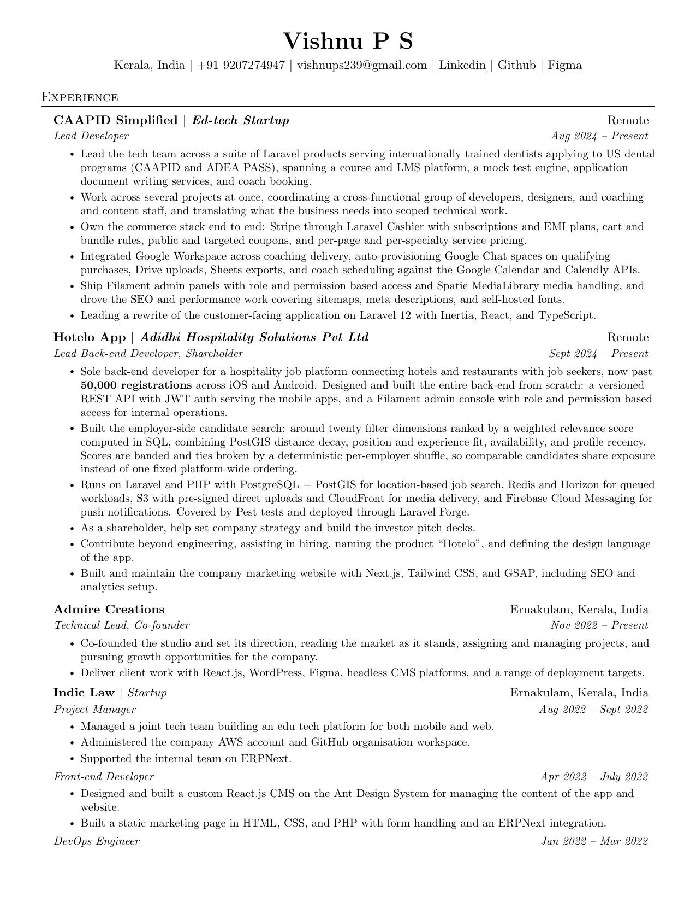
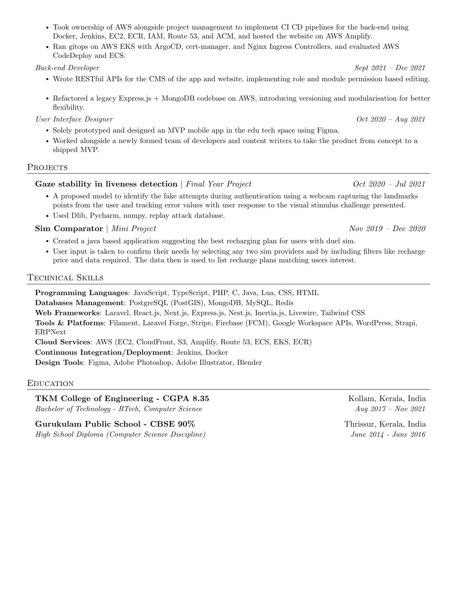

## Resume/CV

My resume/CV written in latex and hot reloaded with the help of `neovim` and `vimtex`.
Full configuration for this setup can be found [here](https://github.com/woomiz/config/tree/master/ubuntu)

Three documents are built from the same components:

| Document | Source | Experience | Skills | Education | Pages |
| --- | --- | --- | --- | --- | --- |
| Resume (elaborate) | `resume.tex` | `experiance.tex` | `skills.tex` | `education.tex` | 2 |
| Resume (condensed) | `resume-condensed.tex` | `experiance-condensed.tex` | `skills-condensed.tex` | `education-condensed.tex` | 1 |
| CV | `cv.tex` | `experiance.tex` + projects | `skills.tex` | `education.tex` | 2 |

Section order in every document is Experience → (Projects) → Technical Skills → Education.
The condensed education file drops the high school entry; the full one keeps it.

All components live in `components/`. When a role or skill changes, update **both**
the full and the `-condensed` file so the variants stay in sync. The condensed
variant is tuned to land on exactly one page — re-check the page count after edits:

```sh
latexmk -g -pdf -output-directory=output -interaction=nonstopmode resume-condensed.tex
pdfinfo output/resume-condensed.pdf | grep Pages
```

- View/Download the elaborate Resume [pdf](./output/resume.pdf)
- View/Download the condensed Resume [pdf](./output/resume-condensed.pdf)
- View/Download the generated CV [pdf](./output/cv.pdf)

### Resume (condensed)



### Resume (elaborate)




### CV



